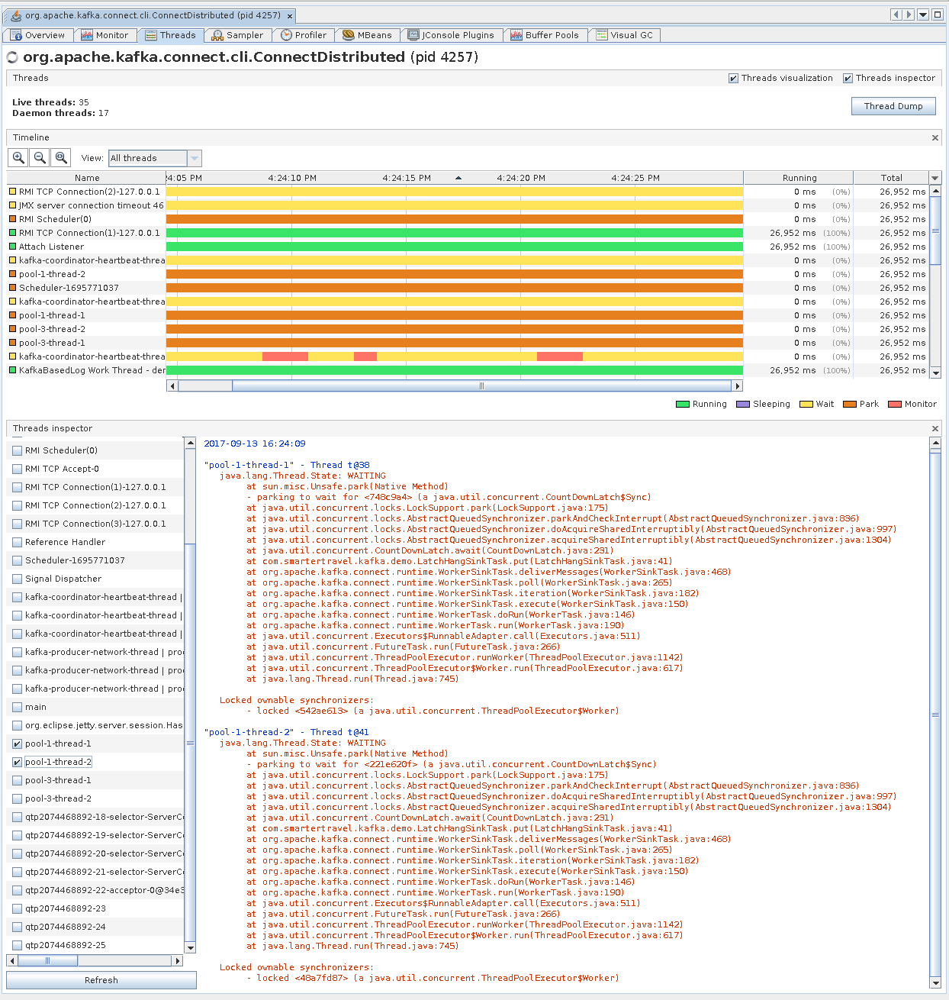

# Hang Connector

Demo to show how Kafka Connect tasks blocked on network operations can cause the worker to end up in an invalid state.

Instructions for running the connector (with stand-alone or distributed workers) are given below.
 
## Common Instructions

Set up a `projects` directory. Obviously, you can adjust this to your preferences, but using fixed directory
in these instructions makes them easier to write.

```bash
mkdir $HOME/projects
```

Clone and build the connector

```bash
cd $HOME/projects
git clone https://github.com/smarter-travel-media/hang-connector.git
cd hang-connector
mvn clean install
cd ..
```

Get Kafka

```bash
cd $HOME/projects
git clone https://github.com/apache/kafka.git

# Follow the instructions for Kafka to set it up and build it
```

## Stand-alone Kafka Connect

Edit the file `connect-standalone.properties` in the `hang-connector` project. Change the setting 
`bootstrap.servers` to be a server(s) in your Kafka cluster.

```bash
cd $HOME/projects
emacs hang-connector/connect-standalone.properties 
```

Start the stand-alone Kafka Connect worker with the `hang-connector`

```bash
cd $HOME/projects/kafka
CLASSPATH=~/.m2/repository/com/smartertravel/kafka/hang-connector/1.0.0-SNAPSHOT/* ./bin/connect-standalone.sh ../hang-connector/connect-standalone.properties ../hang-connector/sink-hang-connector.properties
```

## Distributed Kafka Connect

Edit the file `connect-distributed-1.properties` in the `hang-connector` project. Change the setting 
`bootstrap.servers` to be a server(s) in your Kafka cluster.

```bash
cd $HOME/projects
emacs hang-connector/connect-distributed-1.properties 
```

Create the required topics to be using by the distributed Kafka Connect worker. Substitute the host name below
with the host name of a server in your Kafka cluster.

```bash
cd $HOME/projects/kafka
./bin/kafka-topics.sh --create --zookeeper 'localhost:2181' --topic 'demo_connect_offsets' --replication-factor 3 --partitions 25
./bin/kafka-topics.sh --create --zookeeper 'localhost:2181' --topic 'demo_connect_configs' --replication-factor 3 --partitions 1
./bin/kafka-topics.sh --create --zookeeper 'localhost:2181' --topic 'demo_connect_status' --replication-factor 3 --partitions 25
```

Start the distributed Kafka Connect worker.

```bash
cd $HOME/projects/kafka
CLASSPATH=~/.m2/repository/com/smartertravel/kafka/hang-connector/1.0.0-SNAPSHOT/* ./bin/connect-distributed.sh ../hang-connector/connect-distributed-1.properties
```


Submit the `hang-connector` via the Kafka Connect REST API.

```bash
cd $HOME/projects/hang-connector
curl -H 'Content-Type: application/json' -X POST --data @'sink-hang-connector.json' http://localhost:8083/connectors
```

## Observe The Hanging Connector

In both cases above (stand-alone and distributed) you should have seen message in the logs from the `hang-connector`
indicating that it was going to start blocking indefinitely.

```bash
[2017-09-13 11:01:54,624] INFO Starting to block on countdown latch in pool-1-thread-1 (com.smartertravel.kafka.demo.LatchHangSinkTask:38)
```

You can also confirm this by inspecting the Kafka Connect JVM in a tool like VisualVM.
 


Note that `pool-1-thread-1` is blocked on a `CountdownLatch`.

## Try Restarting The Badly Behaved Connector

```bash
curl -X POST 'http://localhost:8083/connectors/sink-hang-connector/tasks/0/restart'
```

After the restart you'll see something like this in the logs indicating that the running task couldn't be stopped
but a new one was created anyway.

```bash
[2017-09-13 16:08:47,935] INFO Stopping task sink-hang-connector-0 (org.apache.kafka.connect.runtime.Worker:447)
[2017-09-13 16:08:52,936] ERROR Graceful stop of task sink-hang-connector-0 failed. (org.apache.kafka.connect.runtime.Worker:476)
[2017-09-13 16:08:52,936] INFO Starting task sink-hang-connector-0 (org.apache.kafka.connect.runtime.distributed.DistributedHerder:829)
[2017-09-13 16:08:52,936] INFO Creating task sink-hang-connector-0 (org.apache.kafka.connect.runtime.Worker:358)
```

After this, you can see (again, using VisualVM) that there are now two threads blocked running the task from the
`hang-connector` despite Kafka Connect only running a single task.



Note Kafka Connect is only supposed to be running a single task (in a single thread).

```bash
curl 'http://localhost:8083/connectors/sink-hang-connector' 2>/dev/null | jq .
{
  "name": "sink-hang-connector",
  "config": {
    "connector.class": "com.smartertravel.kafka.demo.LatchHangSinkConnector",
    "tasks.max": "1",
    "topics": "some_demo_topic",
    "name": "sink-hang-connector"
  },
  "tasks": [
    {
      "connector": "sink-hang-connector",
      "task": 0
    }
  ]
}
```

## Results

As shown above:

* Tasks are asked nicely to stop via setting a `stopping` flag.
* They are *not forced* to stop via something like `Future.cancel(true)`.
* Every time a badly behaved task is restarted, another thread that will spin forever is created.

I think this constitutes a bug because:

* While people shouldn't be running malicious connectors, they often run connectors developed by third parties.
* A single bug in one of these third party connectors (waiting on a lock, doing blocking I/O without timeouts) can
  put the Kafka Connect application into a invalid state (multiple threads running for a single task).

I originally started investigating this bug because I ran into a situation identical to this problem on
[Stack Overflow](https://stackoverflow.com/questions/43802156/inconsistent-connector-state-connectexception-task-already-exists-in-this-work)
in our production environment following a network outage (though I was not able to reproduce it exactly).

## Solution

In order to prevent blocked threads from running indefinitely I think they should be interrupted as a last resort
in the method `Worker::awaitStopTask(ConnectorTaskId taskId, long timeout)`. That method might be changed to look
like this:

```java
private void awaitStopTask(ConnectorTaskId taskId, long timeout) {
    WorkerTask task = tasks.remove(taskId);
    Future<?> taskThread = threads.remove(taskId);
    if (task == null) {
        log.warn("Ignoring await stop request for non-present task {}", taskId);
        return;
    }

    if (!task.awaitStop(timeout)) {
        log.error("Graceful stop of task {} failed.", task.id());
        task.cancel();
            
        taskThread.cancel(true);
    }
}
```

A more complete version of this change can be found here: https://github.com/smarter-travel-media/kafka/commit/295c747a9fd82ee8b30556c89c31e0bfcce5a2c5

