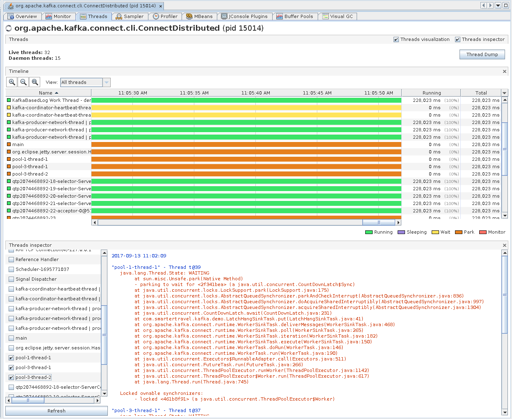

# Hang Connector

Demo to show how Kafka Connect tasks blocked on network operations can cause the worker to end up in an invalid state.

Instructions for running the connector (with stand-alone or distributed workers) are given below.
 
## Common Instructions

Set up a `projects` directory. Obviously, you can adjust this to your preferences, but using fixed directory
in these instructions makes them easier to write.

```bash
mkdir $HOME/projects
```

Clone and build the connector

```bash
cd $HOME/projects
git clone https://github.com/smarter-travel-media/hang-connector.git
cd hang-connector
mvn clean install
cd ..
```

Get Kafka

```bash
cd $HOME/projects
git clone https://github.com/apache/kafka.git

# Follow the instructions for Kafka to set it up and build it
```

## Stand-alone Kafka Connect

Edit the file `connect-standalone.properties` in the `hang-connector` project. Change the setting 
`bootstrap.servers` to be a server(s) in your Kafka cluster.

```bash
cd $HOME/projects
emacs hang-connector/connect-standalone.properties 
```

Start the stand-alone Kafka Connect worker with the `hang-connector`

```bash
cd $HOME/projects/kafka
CLASSPATH=~/.m2/repository/com/smartertravel/kafka/hang-connector/1.0.0-SNAPSHOT/* ./bin/connect-standalone.sh ../hang-connector/connect-standalone.properties ../hang-connector/sink-hang-connector.properties
```

## Distributed Kafka Connect

Edit the file `connect-distributed.properties` in the `hang-connector` project. Change the setting 
`bootstrap.servers` to be a server(s) in your Kafka cluster.

```bash
cd $HOME/projects
emacs hang-connector/connect-distributed.properties 
```

Create the required topics to be using by the distributed Kafka Connect worker. Substitute the host name below
with the host name of a server in your Kafka cluster.

```bash
cd $HOME/projects/kafka
./bin/kafka-topics.sh --create --zookeeper 'localhost:2181' --topic 'demo_connect_offsets' --replication-factor 3 --partitions 25
./bin/kafka-topics.sh --create --zookeeper 'localhost:2181' --topic 'demo_connect_configs' --replication-factor 3 --partitions 1
./bin/kafka-topics.sh --create --zookeeper 'localhost:2181' --topic 'demo_connect_status' --replication-factor 3 --partitions 25
```

Start the distributed Kafka Connect worker.

```bash
cd $HOME/projects/kafka
CLASSPATH=~/.m2/repository/com/smartertravel/kafka/hang-connector/1.0.0-SNAPSHOT/* ./bin/connect-distributed.sh ../hang-connector/connect-distributed.properties
```


Submit the `hang-connector` via the Kafka Connect REST API.

```bash
cd $HOME/projects/hang-connector
curl -H 'Content-Type: application/json' -X POST --data @'sink-hang-connector.json' http://localhost:8083/connectors
```

## Observe The Hanging Connector

In both cases above (stand-alone and distributed) you should have seen message in the logs from the `hang-connector`
indicating that it was going to start blocking indefinitely.

```bash
[2017-09-13 11:01:54,624] INFO Starting to block on countdown latch in pool-1-thread-1 (com.smartertravel.kafka.demo.LatchHangSinkTask:38)
```

You can also confirm this by inspecting the Kafka Connect JVM in a tool like VisualVM.
 


Note that `pool-1-thread-1` is blocked on a `CountdownLatch`.

## Try Restarting The Badly Behaved Connector

```bash
curl -X POST 'http://localhost:8083/connectors/sink-hang-connector/tasks/0/restart'
```

The results of trying to restart the badly behaved connector depend on if you are running stand-alone mode or
distributed mode.